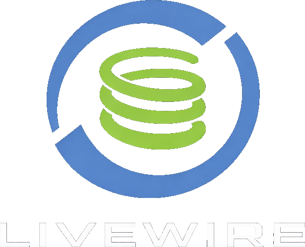

<div align="center">
  
</div>

# ⚡ Livewire

[](https://central.sonatype.com/artifact/net.brdloush/livewire)
[](https://spring.io/projects/spring-boot)
[](https://hibernate.org)
[](https://openjdk.org)
[](LICENSE)
[](https://ko-fi.com/brdloush)

> *A live nREPL wire into your running Spring Boot app. Dev only. You've been warned.*

Your AI agent can read your code. What it **can't** do is ask your app a question.

Livewire fixes that. It embeds a Clojure nREPL server inside a running Spring Boot application —
giving an AI agent (or a curious developer) a live, stateful probe into the JVM.
Beans, queries, transactions, security context, and all.

```clojure
;; How many queries does /api/books actually fire?
(trace/detect-n+1
  (trace/trace-sql
    (lw/run-as "member1"
      (.getBooks (lw/bean "bookController")))))
;; => {:total-queries 481, :suspicious-queries [{...} {:count 200} ...]}
```

481 queries. For a list page. Now you know. Now you can fix it — without restarting the app.

> **Not a Clojure developer?** Don't worry about the syntax above — the agent writes and runs it for you.
> The parentheses look foreign at first, but the language is actually small, consistent, and surprisingly
> readable once your eyes adjust. If you ever feel curious enough to type a snippet yourself,
> the basics take an afternoon. You won't regret it. But you don't have to.

---

## ⚠️ Early-stage project — expect rough edges

Livewire is young. The core ideas are solid and it works well in practice, but the API surface
(Clojure function names and signatures, CLI wrapper scripts, `SKILL.md` structure) **will change**
as the tool evolves.

This matters less here than it would in a traditional library — and that's by design.

The real contract between Livewire and an AI agent isn't the Clojure API; it's **`SKILL.md`**.
The agent reads the skill file fresh at the start of every session. When the API changes,
`SKILL.md` changes with it, and the agent adapts automatically — no version pinning, no
migration guide to follow. The surface can evolve without breaking the workflow.

Development itself is heavily AI-assisted, which keeps `SKILL.md` honest: the same agent
that uses Livewire helps build it, so the documentation reflects how the tool actually
behaves, not how it was originally specced.

**What this means in practice:**
- Pin a version in your `pom.xml` / `build.gradle` if you need stability
- After upgrading, copy the new `skills/livewire/` directory from the release (`SKILL.md` and the `bin/` wrapper scripts) — that's all the migration there is
- Feedback, bug reports, and ideas are very welcome

---

## The problem

Modern Spring Boot development has a fundamental feedback loop problem.
AI agents make it worse.

```
edit → restart (30–120s) → observe → repeat
```

Agents reason **statically**. They read the code, form a hypothesis, and apply a fix —
but they can't observe the running system. So they guess. And when they're wrong,
you restart again.

Livewire breaks the loop:

```
observe → hypothesise → hot-swap → verify → recompile
         (zero restarts ──────────────────────────────)
```

Recompile and the query-watcher auto-applies your `@Query` changes live.
No REPL call needed — no restart either.

---

## Installation

### Prerequisites

| Requirement | Notes |
|---|---|
| ☕ Java 17+ | Required |
| 🍃 Spring Boot 3.x or 4.x | Hibernate 6 and 7 both supported |
| 🤖 AI agent | Claude Code, ECA, or any agent with an nREPL tool |
| 🍺 [bbin](https://github.com/babashka/bbin) | For installing `clj-nrepl-eval` |
| ⚡ `clj-nrepl-eval` | CLI wrapper the agent uses to talk to the nREPL (see Connecting below) |

### Add the dependency

Scope it to your local/dev profile — Livewire should **never ship to production**.

**Maven**
```xml
<dependency>
  <groupId>net.brdloush</groupId>
  <artifactId>livewire</artifactId>
  <version>0.8.0</version>
  <!-- scope to dev — never ship this to production -->
</dependency>
```

**Gradle**
```groovy
// developmentOnly or a dev-profile configuration
developmentOnly 'net.brdloush:livewire:0.8.0'
```

---

## Activation

Livewire auto-configures itself when **two conditions are met**:

1. The JAR is on the classpath
2. The property `livewire.enabled=true` is set

Add it to whichever local properties file your project already uses:

```properties
# application-local.properties  (or -dev, -sandbox, whatever you call it)
livewire.enabled=true

# Optional: override the default nREPL port
livewire.nrepl.port=7888
```

```yaml
# application-local.yml
livewire:
  enabled: true
  # nrepl:
  #   port: 7888
```

You'll see this in the logs on startup:
```
[livewire] nREPL server started on port 7888 with user aliases (lw, q, intro, trace, qw, hq, jpa, mvc, faker, cg)
```

That's it. No annotations, no Spring profiles to configure, no code changes.

---

## Connecting

### CIDER (Emacs)

```
M-x cider-connect-clj  →  localhost  →  7888
```

All 8 namespaces are pre-aliased in the `user` namespace at startup — no `require` needed:

| Alias | Namespace |
|---|---|
| `lw` | `core` — beans, transactions, run-as, properties |
| `q` | `query` — raw SQL, diff-entity |
| `intro` | `introspect` — endpoints, entities, schema |
| `trace` | `trace` — SQL tracing, N+1 detection |
| `qw` | `query-watcher` — auto-apply @Query on recompile |
| `hq` | `hot-queries` — live @Query swap + restore |
| `jpa` | `jpa-query` — JPQL via live EntityManager |
| `mvc` | `mvc` — response serialization |
| `faker` | `faker` — test data generation via datafaker heuristics |
| `cg` | `callgraph` — blast-radius impact analysis |

Just connect and start typing — `(lw/info)` is a good smoke-test.

### Terminal

```bash
clojure -Sdeps '{:deps {nrepl/nrepl {:mvn/version "1.3.1"}}}' \
        -M -m nrepl.cmdline --connect --host 127.0.0.1 --port 7888
```

### AI agents (Claude Code, ECA, etc.)

For AI agent use, you'll need **`clj-nrepl-eval`** — a tiny CLI tool the agent uses to
evaluate Clojure expressions against the live nREPL. Install it via
[bbin](https://github.com/babashka/bbin):

```bash
bbin install https://github.com/bhauman/clojure-mcp-light.git \
  --tag v0.2.1 \
  --as clj-nrepl-eval \
  --main-opts '["-m" "clojure-mcp-light.nrepl-eval"]'
```

Then point your agent at port 7888 and load the Livewire skill (see the SKILL.md section
below). All 8 namespaces are pre-aliased at startup — no manual `require` needed.

Start every session with `lw-start` — it discovers the nREPL, prints app info, and confirms
the connection is live:

```bash
lw-start
# [livewire] connected to localhost:7888
# {:application-name "my-app", :spring-boot-version "4.0.1",
#  :hibernate-version "7.2.0.Final", :java-version "21"}
```

---

## What you can do

### 🔍 Inspect beans and properties

```clojure
;; Convert any Java object to a Clojure map — works for both plain JavaBeans and
;; Java records (DTOs). Use this instead of clojure.core/bean, which silently
;; returns {} for records (no error, just missing fields).
(lw/bean->map some-dto)
;; => {:totalBooks 200, :totalAuthors 30, ...}

;; What repos are registered?
(lw/find-beans-matching ".*Repository.*")
;; => ("bookRepository" "authorRepository" "reviewRepository" ...)

;; All registered bean names
(lw/bean-names)
;; => ("bookRepository" "authorRepository" ... "dataSource" ...)

;; All beans of a given type
(lw/beans-of-type javax.sql.DataSource)
;; => [{:name "dataSource", :bean #object[HikariDataSource ...]}]

;; What DB URL is the app actually talking to?
(lw/props-matching "spring\\.datasource\\.url")
;; => {"spring.datasource.url" "jdbc:postgresql://localhost:32808/test"}

;; Runtime environment summary
(lw/info)
;; => {:spring-boot "4.0.1", :spring "7.0.2", :hibernate "7.2.0.Final", :java "25", ...}

;; Wiring of a single bean — what it injects and what injects it
(lw/bean-deps "bookService")
;; => {:bean         "bookService"
;;     :class        "com.example.BookService"
;;     :dependencies ["bookRepository"]
;;     :dependents   ["adminController" "bookController"]}

;; App-level wiring graph — defaults to your own classes only (auto-detected via @SpringBootApplication)
(lw/all-bean-deps)
;; => [{:bean "adminService", :class "com.example.AdminService", :dependencies [...], :dependents [...]} ...]

;; Find high-fan-out coupling candidates
(->> (lw/all-bean-deps)
     (sort-by #(count (:dependencies %)) >)
     (take 10)
     (mapv #(select-keys % [:bean :class :dependencies])))

;; Include Spring infrastructure beans too
(lw/all-bean-deps :app-only false)

;; CLI shorthands
;; lw-bean-deps bookService
;; lw-all-bean-deps

;; @Transactional surface of a single bean
(lw/bean-tx "bookService")
;; => {:bean "bookService" :class "com.example.BookService"
;;     :methods [{:method "archiveBook" :propagation :required :read-only false ...}
;;               {:method "getAllBooks"  :propagation :required :read-only true  ...}]}

;; All app-level beans with transactional methods (auto-filtered via @SpringBootApplication)
(lw/all-bean-tx)

;; Smell check: reads not marked read-only
(->> (lw/all-bean-tx)
     (mapcat (fn [b] (map #(assoc % :bean (:bean b)) (:methods b))))
     (filter #(and (not (:read-only %))
                   (re-find #"(?i)^(get|find|list|count|search|fetch)" (:method %)))))

;; CLI shorthands
;; lw-bean-tx bookService
;; lw-all-bean-tx
```

### 🗄️ Run queries safely

```clojure
;; Raw SQL through the live DataSource — always cap results
(lw/in-readonly-tx
  (q/sql "SELECT id, title FROM book LIMIT 5"))
;; => [{:id 1, :title "All the King's Men"} ...]

;; Repository calls — always page, never call .findAll without a Pageable
(lw/in-readonly-tx
  (->> (.findAll (lw/bean "bookRepository")
                 (org.springframework.data.domain.PageRequest/of 0 3))
       .getContent
       (mapv #(select-keys (clojure.core/bean %) [:id :title :isbn]))))
;; => [{:id 1, :title "All the King's Men", :isbn "979-0-925405-37-0"} ...]

;; Mutations roll back automatically — safe to experiment
(lw/in-tx
  (.save (lw/bean "bookRepository") ...)
  (.count (lw/bean "bookRepository")))
;; => 201  (and then silently rolled back)
```

### 🔒 Call security-guarded methods

Spring Security doesn't know about your REPL. Without a `SecurityContext` it'll throw
`AuthenticationCredentialsNotFoundException` the moment you call anything `@PreAuthorize`-guarded.
`run-as` sets one for the duration of the call:

```clojure
;; ✅ Preferred: vector form — [username role1 role2 ...]
(lw/run-as ["repl-user" "ROLE_MEMBER"]
  (.getBookById (lw/bean "bookController") 25))

;; Multiple roles
(lw/run-as ["repl-user" "ROLE_ADMIN" "ROLE_MEMBER"]
  (.getStats (lw/bean "adminController")))

;; ⚠️ Plain string form — only grants ROLE_USER + ROLE_ADMIN
;; Will throw AuthorizationDeniedException for MEMBER/VIEWER-gated endpoints
(lw/run-as "admin"
  (.getBookById (lw/bean "bookController") 25))
```

### 🔬 Trace SQL and detect N+1

```clojure
;; See every SQL a call fires — wrap it and look
(trace/trace-sql
  (lw/in-readonly-tx
    (.count (lw/bean "bookRepository"))))
;; => {:result 200, :count 1, :duration-ms 8,
;;     :queries [{:sql "select count(*) from book b1_0", :caller "..."}]}

;; Detect N+1 automatically
(trace/detect-n+1
  (trace/trace-sql
    (lw/run-as "member1"
      (.getBooks (lw/bean "bookController")))))
;; => {:total-queries 481,
;;     :suspicious-queries [{:sql "select ... from book_genre ...", :count 200}
;;                          {:sql "select ... from review ...",     :count 200}
;;                          {:sql "select ... from library_member", :count 50}
;;                          {:sql "select ... from author ...",     :count 30}]}

;; For @Async / CompletableFuture — capture SQL across all threads
(trace/trace-sql-global
  (lw/run-as "member1"
    (.getBooksByGenreAsync (lw/bean "bookService") 1)))
;; => {:result [...], :count 12, :queries [...]}
```

481 queries for one endpoint. Four N+1 suspects flagged automatically.
Now let's fix it.

### 🔥 Hot-swap a `@Query` live

No restart needed. Swap the JPQL, verify with `trace-sql`, iterate, commit the fix:

```clojure
;; See what @Query methods exist on a repo
(hq/list-queries "bookRepository")
;; => ({:method "findAllWithAuthorAndGenres",
;;      :jpql "SELECT DISTINCT b FROM Book b JOIN FETCH b.author LEFT JOIN FETCH b.genres"}
;;     {:method "findByGenreId", ...} ...)

;; Swap to a candidate fix
(hq/hot-swap-query! "bookRepository" "findAllWithAuthorAndGenres"
  "SELECT DISTINCT b FROM Book b JOIN FETCH b.author
   LEFT JOIN FETCH b.genres LEFT JOIN FETCH b.reviews")

;; Verify — does the query count drop?
(trace/trace-sql
  (lw/run-as "member1"
    (.getBooks (lw/bean "bookController"))))

;; Restore when done — don't leave swapped queries hanging
(hq/reset-all!)
;; => [["bookRepository" "findAllWithAuthorAndGenres"]]
```

Alternatively: just edit the `@Query` in your IDE, recompile, and the query-watcher
picks it up automatically — same result, no REPL call:

```clojure
;; Check watcher status
(qw/status)
;; => {:running? true, :disk-state-size 8}

;; After recompiling in your IDE — watcher fires automatically:
;; [query-watcher] detected change: bookRepository#findAllWithAuthorAndGenres
;; [hot-queries] watcher re-swapped ✓
```

### 🧭 Introspect the app's structure

```clojure
;; All HTTP endpoints — auth, param sources, and required/optional flags
(->> (intro/list-endpoints)
     (filter #(re-find #"books" (str (:paths %))))
     (mapv #(select-keys % [:paths :methods :handler-method :pre-authorize :required-roles :parameters])))
;; => [{:paths ["/api/books"], :methods ["GET"],
;;      :handler-method "getBooks", :pre-authorize "hasRole('MEMBER')",
;;      :required-roles ["MEMBER"], :parameters []}
;;     {:paths ["/api/books/{id}"], :methods ["GET"],
;;      :handler-method "getBookById", :required-roles ["MEMBER"],
;;      :parameters [{:name nil, :type "java.lang.Long", :source :path, :required true}]}]

;; All Hibernate-managed entities
(map :name (intro/list-entities))
;; => ("Author" "Book" "Genre" "LoanRecord" "LibraryMember" "Review")

;; Entity schema for one entity — straight from Hibernate's live metamodel
(intro/inspect-entity "Book")
;; => {:table-name "book",
;;     :identifier {:name "id", :columns ["id"], :type "long"},
;;     :properties [{:name "title", :columns ["title"], :type "string", :is-association false} ...]}

;; Full domain model in one call — great for ER diagrams
(intro/inspect-all-entities)
;; => {"Book"   {:table-name "book", :identifier {...}, :properties [...]}
;;     "Author" {:table-name "author", ...}
;;     ...}
```

### 📄 Run JPQL with smart entity serialization

```clojure
;; Execute any JPQL via the live EntityManager — returns plain Clojure maps
(jpa/jpa-query "SELECT b FROM Book b ORDER BY b.id" :page 0 :page-size 5)
;; => [{:id 1, :title "All the King's Men", :author {:id 6, ...}, :genres "<lazy>"} ...]

;; Scalar projections with AS aliases become named keys
(jpa/jpa-query
  "SELECT b.title AS title, COUNT(lr) AS loans
   FROM Book b JOIN b.loanRecords lr
   GROUP BY b.id, b.title ORDER BY COUNT(lr) DESC"
  :page-size 5)
;; => [{:title "Vanity Fair", :loans 7} ...]
```

Lazy collections render as `"<lazy>"` rather than firing surprise queries.
Paged by default (`:page-size 20`).

### 🎯 Call controller endpoints and serialize the response

```clojure
;; Invoke a controller method under a live SecurityContext
;; and serialize with the exact same Jackson ObjectMapper Spring MVC uses
(mvc/serialize
  (lw/run-as ["repl-user" "ROLE_MEMBER"]
    (.getBooks (lw/bean "bookController")))
  :limit 3)
;; => ^{:total 200, :returned 3, :content-size 51529, :content-size-gzip 8299}
;;    [{"id" 1, "title" "All the King's Men", ...} ...]
```

Or use the CLI wrapper (runs traced, returns JSON + metadata):
```bash
lw-call-endpoint bookController getBooks ROLE_MEMBER
lw-call-endpoint --limit 5 adminController getMostLoaned ROLE_ADMIN
```

### 🔎 Observe what a service method actually writes

No database changes — the thunk runs inside a transaction that always rolls back.
The diff shows exactly which fields changed and their old/new values:

```clojure
(q/diff-entity "Book" 42
  (fn [] (.archiveBook (lw/bean "bookService") 42)))
;; => {:before  {:archived false, :archivedAt nil, :availableCopies 3}
;;     :after   {:archived true,  :archivedAt "2026-03-15T23:49", :availableCopies 3}
;;     :changed {:archived   [false true]
;;               :archivedAt [nil "2026-03-15T23:49"]}}
```

Useful for discovering unintended writes, verifying a fix touched exactly the right fields,
or systematically calling suspect service methods until the guilty one confesses.

### 🎲 Generate realistic test data on the fly

No fixture files, no test annotations, no recompile. `faker/build-entity` constructs a valid
Hibernate entity using realistic fake data, optionally persisting it in a rolled-back transaction
so you can call services against a real, DB-assigned id without leaving any data behind:

```clojure
;; Simple entity — no required FKs, just scalar fields
(faker/build-entity "Author")
;; => #object[Author ... {:firstName "Evelyn", :lastName "Hartwell",
;;            :birthYear 1923, :nationality "Montenegrins"}]

;; Let Livewire resolve the full dependency chain automatically
(faker/build-entity "Book" {:auto-deps? true :persist? true})

;; Speculative pattern: persist + rollback — get a real DB-assigned id without leaving data behind
(let [review (faker/build-entity "Review" {:auto-deps? true :persist? true :rollback? true})]
  ;; Call your rating service with a real id — nothing persists after this block
  (.computeAverageRating (lw/bean "ratingService") (.getId review)))
```

Property values are selected by a heuristic table matched against name and type — `firstName`,
`email`, `isbn`, `*Year` suffix, `*At`/`*Since` suffix for timestamps, etc. String values are
clamped to `@Column(length=…)` constraints. Lookup tables (e.g. `Genre`) are fetched from the DB
rather than created new to avoid unique-constraint violations.

Requires `net.datafaker:datafaker` on the target application's classpath. Call
`(faker/available?)` first to confirm:

```clojure
(faker/available?)  ;; => true

;; CLI
;; lw-build-entity Review '{:auto-deps? true :persist? true :rollback? true}'
```


### 💥 Analyze blast radius before changing anything

Before modifying a repository, service method, or query, see which HTTP endpoints,
schedulers, and event listeners would be affected — straight from the live bytecode:

```clojure
;; Which endpoints call bookRepository/findAll, directly or via services?
(cg/blast-radius "bookRepository" "findAll")
;; => {:target   {:bean "bookRepository" :method "findAll"}
;;     :affected [{:bean "bookService"    :method "getAllBooks"      :depth 1 :entry-point nil}
;;                {:bean "bookController" :method "getBooks"         :depth 2
;;                 :entry-point {:type :http-endpoint :paths ["/api/books"] :http-methods ["GET"]
;;                               :pre-authorize "hasRole('MEMBER')"}}
;;                {:bean "bookStatsReporter" :method "reportNightlyStats" :depth 2
;;                 :entry-point {:type :scheduler :cron "0 0 2 * * *"}}]
;;     :warnings ["Method name 'findAll' matched multiple signatures — all overloads are included"]}

;; What breaks if I change bookService/archiveBook?
(cg/blast-radius "bookService" "archiveBook")

;; CLI
;; lw-blast-radius bookRepository findAll
;; lw-blast-radius bookService archiveBook
```

The call-graph index is built once (~30ms for a typical app) and cached for the session.
Call `(cg/reset-blast-radius-cache!)` after hot-patching a class.

---

## ⚠️ Security and data — read this

Livewire is a **dev-only** tool and is intentionally not subtle about it.

### Your data is reachable

The nREPL can query any table, call any service, and access anything the JVM can touch.
This is the point — and the risk. **Never enable Livewire against a production database
or any environment with real user data.**

Use it with:
- A local development database seeded with anonymized or synthetic data
- A sandbox / staging environment that is completely isolated from production
- Testcontainers-spun databases (like the Bloated Shelf playground below)
- A self-hosted LLM — your ground, your rules, no data leaving the building

### The nREPL can execute arbitrary code

There is no sandbox. Connecting to port 7888 means executing arbitrary JVM code.
Exposing this port outside localhost is equivalent to handing over the JVM process.

```properties
# ✅ default — localhost only
livewire.nrepl.bind=127.0.0.1

# ❌ please don't
livewire.nrepl.bind=0.0.0.0
```

Livewire defaults to `127.0.0.1` and will not bind to a broader interface unless
you explicitly tell it to. That's a guardrail, not a permission slip.

> Livewire is provided as-is under the [MIT license](LICENSE). The authors accept
> no liability for misuse, data exposure, or any damage resulting from use outside
> its intended scope.

---

## Try it — the Bloated Shelf playground

[**Bloated Shelf**](https://github.com/brdloush/bloated-shelf) is a real Spring Boot app —
Spring Security, JPA, PostgreSQL, multiple roles, a handful of controllers and services,
a domain model with real relationships. It happens to have an N+1 problem baked in,
but that's just one reason to visit.

The real reason: it's a safe, self-contained Spring app you can hand to an AI agent
along with a live Livewire nREPL and just... see what happens.

**You will be surprised.** Give an agent live, responsive tools with a fast feedback loop
and it stops guessing. It starts *exploring*. It asks questions. It forms hypotheses,
tests them in seconds, and builds on what it learns. The creativity that comes out of
a well-equipped agent with shiny new toys is something you have to see to believe.

**30 authors · 200 books · 50 members · ~5 reviews/book · all lazily loaded**

### Start it

```bash
git clone https://github.com/brdloush/bloated-shelf
cd bloated-shelf
mvn spring-boot:run -Dspring-boot.run.profiles=dev,seed
```

Testcontainers spins up a PostgreSQL 16 container automatically. No external database needed.
The Livewire nREPL comes up on **port 7888**.

### Things to try

- 🔎 **Hunt the N+1**: call the `bookController` and watch `trace-sql` report 481 queries — then fix it without restarting
- 🧭 **Discover the app cold**: ask an agent to map out the domain model, endpoints, and auth rules using only the live REPL — no source reading
- 🔥 **Hot-swap queries**: iterate on JPQL live, measure each variant with `trace-sql`, find the winner, commit
- 🔒 **Test auth boundaries**: call the same endpoint under different roles with `lw/run-as`, see what changes
- 📊 **Profile and compare**: trace the naive N+1 endpoints against the clean aggregation queries in `adminController`
- 🧪 **Prototype in Clojure, ship in Java**: re-implement a service method as a REPL expression, validate query count, *then* write the real fix
- 💬 **Ask nontrivial questions about your data**: *"Which genre has the most overdue loans?"*, *"Who are the top reviewers and what do they have in common?"* — the agent will introspect the entity model, figure out the schema, iterate on queries, and come back with an actual answer. Powerful BI in an agentic chat, no dashboard required
- 🤖 **Let the agent loose**: point a capable agent at the nREPL, give it `SKILL.md` as context, and watch what it does with the freedom

The app ships with an [`AGENTS.md`](https://github.com/brdloush/bloated-shelf/blob/main/AGENTS.md)
covering worked REPL examples, bean names, credentials, and a quick smoke-test —
a solid starting point for an agentic session.

---

## 📖 SKILL.md — the agent's instruction manual

[`skills/livewire/SKILL.md`](skills/livewire/SKILL.md) is the most important file
in this repository if you're working with an AI agent.

It covers the full API across all eight namespaces, worked examples, known pitfalls,
and escalation strategies for debugging without restarts. It's written for agents —
but it's perfectly readable by humans too.

**Without `SKILL.md` in the agent's context, cooperation will be poor.**
The agent will hallucinate method signatures, call things that don't exist,
and make sloppy guesses about behaviour it could just... ask the live app about.
With it, the agent knows exactly what tools it has, how to use them, and what to watch out for.

### Make it discoverable

The skill is a **directory** — `skills/livewire/` — containing `SKILL.md` and the `bin/`
CLI wrapper scripts (`lw-jpa-query`, `lw-call-endpoint`, `lw-sql`, etc.). Copy the whole
thing, not just the markdown file.

First, clone this repository (you don't need to build anything — you just need the files):

```bash
git clone https://github.com/brdloush/livewire
```

Then copy the skill directory into your Spring Boot project:

```bash
# Per-project — checked in alongside the app that uses Livewire (recommended)
cp -r livewire/skills/livewire /your/spring-app/.claude/skills/livewire

# Or symlink it so upgrades are instant (just git pull in the livewire clone)
ln -s /path/to/livewire/skills/livewire /your/spring-app/.claude/skills/livewire
```

Make sure the `bin/` scripts are executable:

```bash
chmod +x /your/spring-app/.claude/skills/livewire/bin/*
```

### Load it explicitly

Even if the file is in place, explicitly telling the agent to load the skill
at the start of a session gets much better results than hoping it gets picked up passively:

> *"Load the Livewire skill."*

That one sentence changes the entire session. The agent switches from guessing to probing.
From static analysis to live questions. From "I think the query might be..." to
"I just measured it — 481 queries. Here's why, and here's the fix."

Quick namespace cheatsheet:

| Namespace | Require as | What it does |
|---|---|---|
| `net.brdloush.livewire.core` | `lw` | Beans, transactions, run-as, properties |
| `net.brdloush.livewire.query` | `q` | Raw SQL, `diff-entity` |
| `net.brdloush.livewire.trace` | `trace` | SQL tracing, N+1 detection |
| `net.brdloush.livewire.hot-queries` | `hq` | Live `@Query` swap + restore |
| `net.brdloush.livewire.query-watcher` | `qw` | Auto-apply `@Query` on recompile |
| `net.brdloush.livewire.introspect` | `intro` | Endpoints, entities, schema |
| `net.brdloush.livewire.jpa-query` | `jpa` | JPQL via live `EntityManager`, smart entity serialization |
| `net.brdloush.livewire.mvc` | `mvc` | Response serialization via Spring MVC's Jackson `ObjectMapper` |

---

## What's next

- 📖 Read the full [SKILL.md](skills/livewire/SKILL.md) — every function, pitfall, and worked example across all eight namespaces
- 🚀 Try the [bloated-shelf](https://github.com/brdloush/bloated-shelf) demo app — a realistic N+1 scenario ready to investigate
- 🐛 Found a bug or have an idea? [Open an issue](https://github.com/brdloush/livewire/issues)

---

## Inspiration

[*Java Troubleshooting on Steroids with Clojure REPL*](https://engineering.telia.no/blog/java-troubleshooting-on-steroids-with-clojure-repl)
by Jakub Holý (2019) — the idea that you can wire a Clojure REPL into a running JVM
and talk to it live was the seed this project grew from. Worth a read.

---

*Don't touch live wires in production. But in dev? Grab on.*
